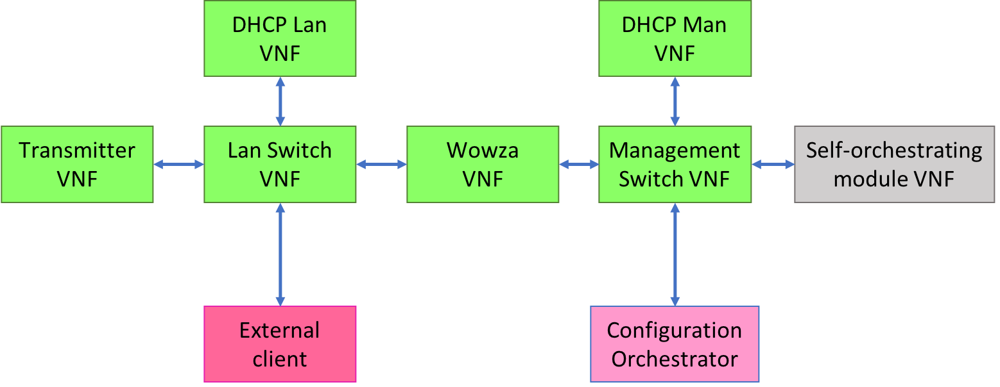
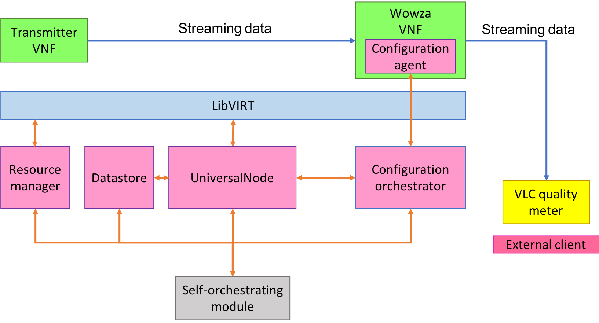

# Validation of the SDO architecture with Wowza
 
This file shows you the steps that must be followed in order to repeat the validation of the SDO architecture.
 
## Requisites & details
 
- The SDO infrastructure must already be installed as described inside the [README](README.md)
- The images required (transmitter, switch and wowza transcoder) must be already loaded inside the datastore repository:
        	- The transmitter image simply transmits a recorded video to Wowza
        	- The switch image implements an L2 Ethernet switch used to build up two different networks:
                    	- The management network that connects Wowza with the Configuration Service running on the host.
                               	- Wowza is configured with the IP 192.168.40.10/24 on the management interface.
                    	- The service network that connects the Transmitter, Wowza and the VLC Client.
                               	- Wowza is configured with the IP 192.168.10.100/24
                               	- The transmitter receives the IP from DHCP.
        	- The Wowza image contains an already configured Wowza with it's own configuration agent
- An external host that runs the [modified VLC client](???) and takes the validation measurements (this host must reach one ip of the Wowza VNF)
- You can run the SDO module wherever you want, but it must reach the Universal Node controller, the datastore, the Configuration service and the Resource manager.
 

 
The [default NFFG](test_nffg_transcoder_demo.json) doesn't contain the "Wowza VNF" because it will be added by the SDO.
 

 
All the interactions between the SDO module and the Wowza VNF passthrough the Configuration orchestrator. The SDO module must talk with: Datastore, Universal node controller, Configuration service and with the Resource manager.
- The datastore is used in order to get the template of VNF that may be added in the NFFG.
- The Universal node API are used in order to get and update the current NFFG.
- The Configuration service API are used to get the state of a VNF and to update its configuration.
- The Resource manager API are used to get the available resources and to ask/release new ones.
 
## Run the validation
 
- Start all the services on the Universal Node Host (un-orchestrator/control.sh start)
- Compile the provided [model](https://github.com/netgroup-polito/sdo-compiler/blob/master/modello_transcoder.json)
- Compile&run the SDO module (e.g. inside IntelliJ Idea)
- If everything is OK, after some minutes you will periodically see as output of the SDO **dd/mm/YYYY hh:ii:ss INFO selforchestratingservices.declarative_new.MyFramework mainLoop: Going to sleep**
- If after some minutes, you periodically see **dd/mm/YYYY hh:ii:ss FINE configurationorchestrator.ConfigurationOrchestratorFrog4 waitUntilStarted: [...]** this means that the configuration service hasn't discovered the Wowza VM so:
        	-Check that the Configuration Agent is running inside the Wowza VM.
        	-Check the connectivity between the Wowza VM and the Configuration service.
        	-Check that the Configuration service and DoubleDecker are running on the host.
 
- After that, The SDO have loaded the base NFFG (with the transmitter, switches, ... ) and have started the new Wowza instance with the available resources.
- Now you can launch the modified VLC client on the external host and connect to Wowza with the URL **http://WOWZA_IP:1935/live/live_360p/playlist.m3u8**.
        	- If you get some errors such as 404, look inside known bugs about Wowza licence system.
- If you would like to modify the available resources inside the infrastructure, you can use the Resource manager [CLI](https://github.com/netgroup-polito/un-sdo-resourcemanager).
- The SDO will react as soon as it detect the changes
 
## URL details
 
The format of the URL used by Wowza is **http://WOWZA_IP:1935/application_name/application_name[transcoder_stream_name]/type_of_stream**:
- Application name is **live**
- Transcoder stream name depends on the stream that you want to watch. Look inside Application->live->Transcoder->(select a transcoder template)->stream name).
- Type of stream depends on the protocol used (Use the test player available inside Wowza for more information).
 
With the "transcode (default)" template, with the "_360p" stream you will get a stream with 200Kbps and with frame size of 640x360 pixels.
With the "TransrateLight" template, with the "_360p" stream you will get a stream equal to the input stream.
 
## Use full tools
 
- Install the "selforch" script onto your PC and run the SelfOrchestrator from your PC
- Use the VNC console of the KVM VMs: they are listening on TCP ports from 5900 to 59XX on localhost (setup a ssh tunnel)
- Use un-orchestrator/control.sh start or un-orchestrator/control.sh stop to start/stop all of the software on the orchestrator host
 
## Known bugs
 
- The configuration agent of Wowza doesn't set the default gateway.
- Sometimes the UN doesn't correctly create the /metadata folder inside the Wowza VM that contains the metadata used by the configuration agent. In that case, simply restart the SDO orchestrator (the NFFG will be removed and loaded again)
- Sometimes the Wowza VM is unable to reach the host interface with ip 192.168.40.1 . In that case reboot the host
- Sometimes the Wowza license system disable the transcoding capabilities.
        	- To fix this, reload the Wowza server by using the web interface on *:8088, login with netgroup as username and with empty password.
        	- Click on "Server" in the menu bar and then "restart" (top-left, under "Sign out")
 
## Selforch script
 
```
#!/bin/bash
 
ssh -L 5900:localhost:5900 \
    	-L 5901:localhost:5901 \
    	-L 5902:localhost:5902 \
    	-L 5903:localhost:5903 \
    	-L 5904:localhost:5904 \
   	 -L 5905:localhost:5905 \
    	-L 5906:localhost:5906 \
    	-L 5907:localhost:5907 \
    	-L 5908:localhost:5908 \
    	-L 5909:localhost:5909 \
    	-L 5910:localhost:5910 \
    	-L 5911:localhost:5911 \
    	-L 5912:localhost:5912 \
    	-L 5913:localhost:5913 \
    	-L 5914:localhost:5914 \
    	-L 5915:localhost:5915 \
    	-L 5916:localhost:5916 \
    	-L 5917:localhost:5917 \
    	-L 5918:localhost:5918 \
    	-L 8079:localhost:8079 \
    	-L 8080:localhost:8080 \
    	-L 8081:localhost:8081 \
    	-L 8082:localhost:8082 \
    	-L 8088:192.168.40.10:8088 \
    	-L 1935:192.168.40.10:1935 \
    	-L 9999:localhost:9999 \
    	root@$1 -p2222
```

